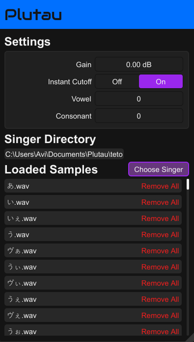

# Plutau

An UTAU plugin for your DAW
Made with [nih-plug](https://github.com/robbert-vdh/nih-plug.git).
Based on [nih-sampler](https://github.com/matidfk/nih-sampler).

Run with:

`cargo xtask bundle plutau --release`

Features:
- Automatically reload and resample all samples when sample rate changes
- Min and max volume, the volume is calculated by mapping velocity
- Deterministic sample picker

# TODO:
- find better font
- perhaps add features to not have to use multiple instances of the plugin (like the old version)
- add different channel config support
- update to latest versions
- add icons
- cache the file for transferrability between devices

All code is licensed under the [GPLv3](https://www.gnu.org/licenses/gpl-3.0.txt) license.
